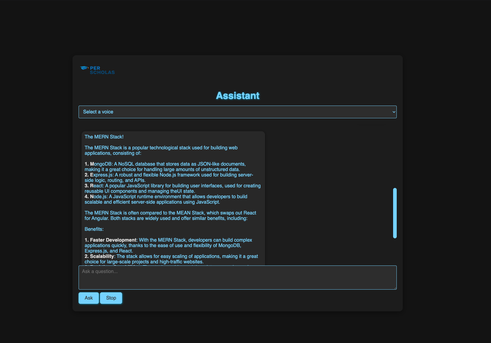

# 🦙 Llama-Powered Chat Application

Welcome to the **Llama-Powered Chat Application**, a dynamic and responsive web application that leverages the power of the Llama API for intelligent chat completions, and integrates advanced browser features like SpeechSynthesis for text-to-speech functionality. This project is built using HTML, CSS, and JavaScript, focusing on modern web standards and user-friendly interactions.

## ✨ Features

- **Llama API Integration**:
  - Seamless connection to the Llama API for generating smart and context-aware chat completions.
  - Utilizes the `llama3-8b-8192` model to provide accurate and relevant responses based on user input.
- **Interactive Chat Interface**:

  - User-friendly chat UI with real-time response generation.
  - Typing indicators to enhance the chat experience.

- **SpeechSynthesis Integration**:

  - Converts chat responses to speech using the browser's built-in `SpeechSynthesis` API.
  - Allows users to toggle audio playback with intuitive buttons.
  - Support for multiple voices and easy selection through a dropdown menu.

- **Responsive Design**:

  - Ensures the application looks great on both desktop and mobile devices.
  - Dark mode inspired by Atom One theme for a sleek, modern interface.

- **Smooth Scrolling and User Controls**:
  - Automatically scrolls the chat to the latest messages, with controls to pause scrolling when reviewing past messages.
  - Ability to stop and resume response generation, ensuring user control over the chat flow.

## 🚀 Technologies Used

- **Frontend**:

  - **HTML5**: Semantic and structured markup.
  - **CSS3**: Responsive design, dark theme styling.
  - **JavaScript**: Logic for handling chat interactions, API integration, and SpeechSynthesis.

- **APIs**:
  - **Llama API**: For generating chat completions.
  - **SpeechSynthesis API**: For converting text responses into speech.

---

Enjoy using the Llama-Powered Chat Application! This project showcases how powerful modern web technologies can be when combined with intelligent API services and built-in browser features.
